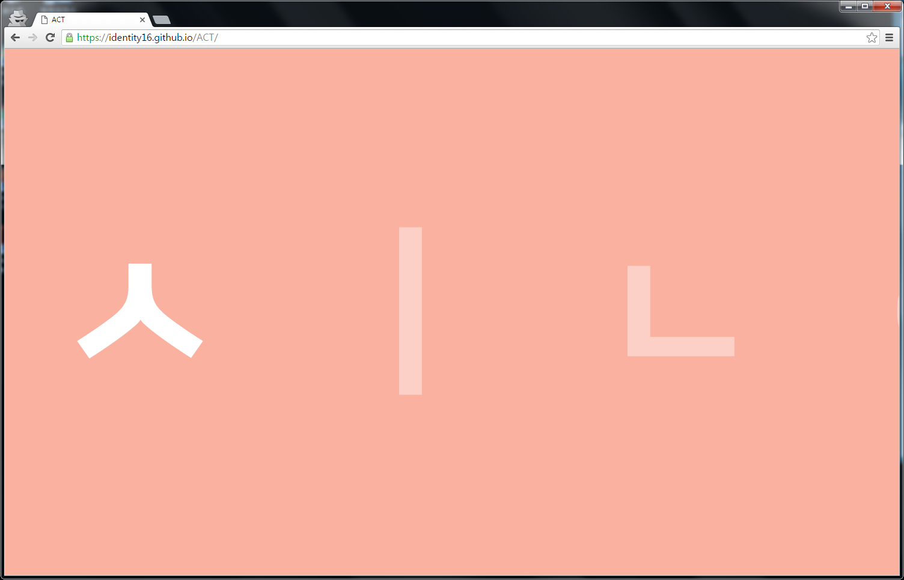
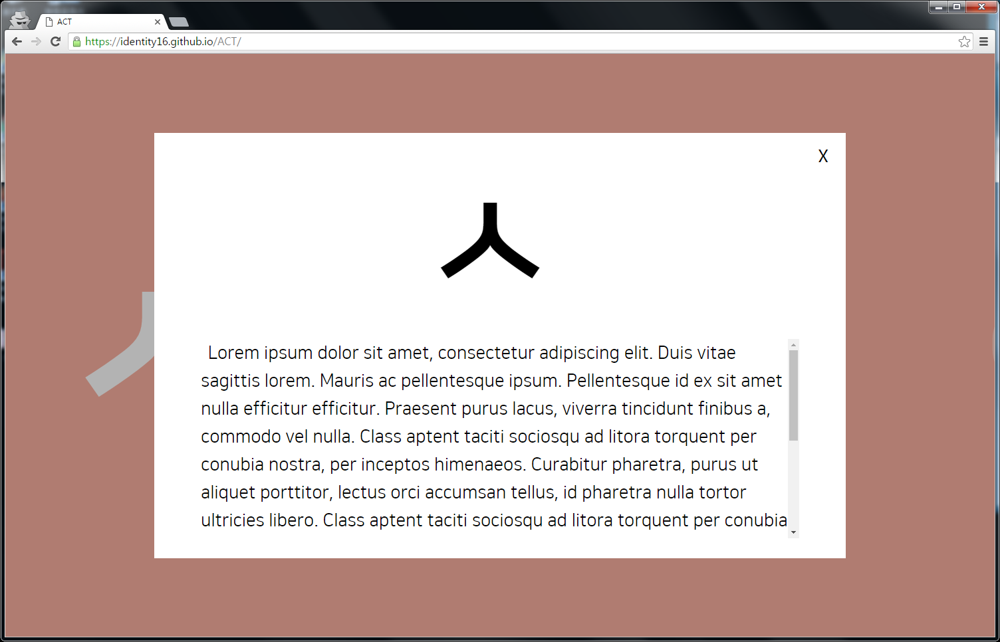
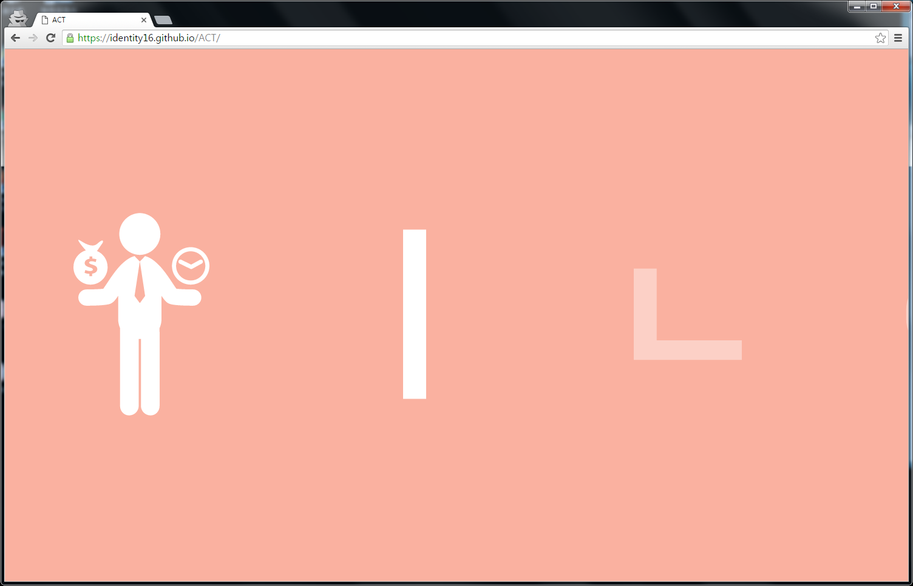
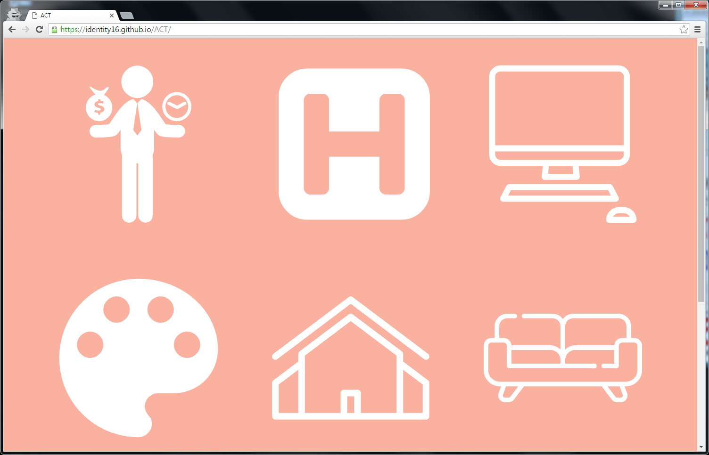

# [ACT](https://identity16.github.io/)
 ACT 수업(중앙대학교 공통교양)의 자유형식 과제를 하기 위해 만든 페이지입니다.

## 설명
- 이름(한글)의 자/모음이 가로로 나열됩니다.

- 각 글자를 차례로 클릭하면 모달이 뜨고 거기에 내용을 넣을 수 있습니다.

- 모달을 닫으면 클릭했던 글자가 SVG 아이콘으로 바뀝니다.

- 모든 글자에 해당하는 내용을 전부 보면 모든 아이콘이 보기 좋게 배치됩니다.

## ETC
 `npm install`을 한 후, `npm run build`를 실행하면 babel을 이용해 변환된 코드가 dist 폴더에 생성됩니다. 실제로 동작하는 코드는 dist에 있는 JS 파일입니다.

## Todo
- 코드 가독성 향상
- SVG를 string이 아닌 파일으로 불러오기
- 이름, 본문, 아이콘 등을 편리하게 지정할 수 있도록 변경